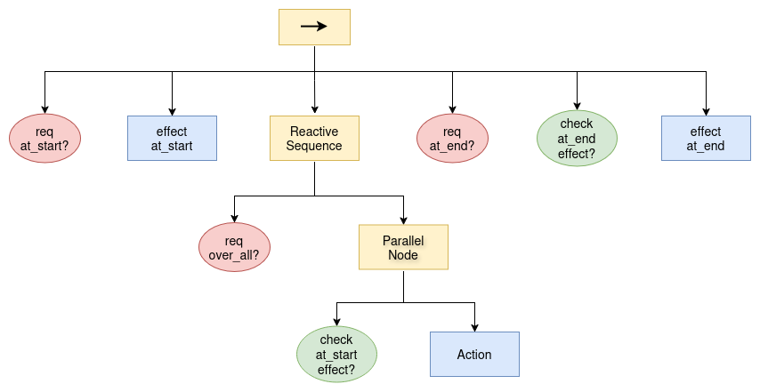

# PlanSys2 Monitoring Examples

This repository provides example packages demonstrating a **monitoring extension for PlanSys2 plan execution**.

The **PlanSys2 monitoring extension itself** is implemented in a fork of the official repository, in the `effect-monitoring` branch:
- https://github.com/eugenio24/ros2_planning_system/tree/effect-monitoring

For an overview of how the monitoring is achieved, see the section [Monitoring Architecture Overview](#monitoring-architecture-overview) below.

---

## Table of Contents
1. [Example Packages](#example-packages)
2. [Sensing Plugins Overview](#sensing-plugins-overview)
3. [Enabling Monitoring in PlanSys2](#enabling-monitoring-in-plansys2)
4. [Registering Sensing Plugins](#registering-sensing-plugins-with-plansys2)
5. [Monitoring Architecture Overview](#monitoring-architecture-overview)
6. [Fake Sensing Utility](#fake-sensing-utility)

---

### Example Packages
- `plansys2_monitoring_simple_example`: A simple example based on the [PlanSys2 Simple Example](https://github.com/PlanSys2/ros2_planning_system_examples/tree/rolling/plansys2_simple_example)

- `plansys2_monitoring_numeric_example`: An example that also includes numeric fluents and numeric expressions in the effects.

The goal of these examples is not to provide realistic sensing, but to demonstrate **how sensing plugins are integrated into PlanSys2** and can be used for monitoring.

---

## Sensing Plugins Overview

The monitoring is performed with sensing plugins, which implement one of two interfaces:

| Effect Type           | Interface                        |
| --------------------- | -------------------------------- |
| Predicate effect      | `plansys2::PredicateSensingBase` |
| Functions / Numeric expression effect        | `plansys2::FunctionSensingBase`  |


Each plugin:
- Implements the corresponding interface
- Sense either the truth value of a predicate or the value of a function.
- Is loaded dynamically by PlanSys2 via `pluginlib`
- Must be implemented in the namespace: `plansys2_sensing_plugins`

Example plugin implementations can be found in:
```
plansys2_monitoring_simple_example/src/sensing_plugins
plansys2_monitoring_numeric_example/src/sensing_plugins
```

---

## Enabling Monitoring in PlanSys2

To enable the PlanSys2 **monitoring extension** during plan execution, specify the monitored action BT (`plansys2_action_bt_monitored.xml`) via the `action_bt_file` argument in your Python launch file. As an example, see: `plansys2_monitoring_simple_example/launch/plansys2_monitoring_simple_example_launch.py`.

```python
'action_bt_file': os.path.join(
    get_package_share_directory('plansys2_executor'),
    'behavior_trees',
    'plansys2_action_bt_monitored.xml'
)
```

This tells the PlanSys2 behavior tree builder to use, for each action, a subtree that includes additional nodes to check the action's start and end effects, instead of the default subtree.

---

## Registering Sensing Plugins with PlanSys2

### 1. CMake Configuration

Add to `CMakeLists.txt` the sensing plugins so that they are compiled as a shared library:

```cmake
add_library(
  plansys2_sensing_plugins
  SHARED
  src/sensing_plugins/battery_full_sensing.cpp
  src/sensing_plugins/battery_low_sensing.cpp
  src/sensing_plugins/robot_at_sensing.cpp
)
```

```cmake
ament_target_dependencies(plansys2_sensing_plugins
  rclcpp
  plansys2_executor
  pluginlib
)
```

---

### 2. Plugin Description File

Create a plugin XML file (e.g. `plansys2_monitoring_simple_example_sensing_plugins.xml`) to register your plugins with `pluginlib`

```xml
<library path="plansys2_sensing_plugins">

  <class
    type="plansys2_sensing_plugins::RobotAtPredicateSensor"
    base_class_type="plansys2::PredicateSensingBase">
    <description>RobotAt sensing plugin.</description>
  </class>

  <class
    type="plansys2_sensing_plugins::BatteryFullPredicateSensor"
    base_class_type="plansys2::PredicateSensingBase">
    <description>BatteryFull sensing plugin.</description>
  </class>

  <class
    type="plansys2_sensing_plugins::BatteryLowPredicateSensor"
    base_class_type="plansys2::PredicateSensingBase">
    <description>BatteryLow sensing plugin.</description>
  </class>

</library>
```

The namespace **must match exactly** the plugin implementation:

```cpp
plansys2_sensing_plugins::*
```

---

### 3. Exporting Plugins

The plugins description is exported in `CMakeLists.txt` using:

```cmake
pluginlib_export_plugin_description_file(
  plansys2_executor
  plansys2_monitoring_simple_example_sensing_plugins.xml
)

ament_export_libraries(plansys2_sensing_plugins)
```

The XML file is installed so that PlanSys2 can discover it:

```cmake
install(FILES
  plansys2_monitoring_simple_example_sensing_plugins.xml
  DESTINATION share/${PROJECT_NAME}
)
```

---

### 4. Exporting the Plugin Class

At the bottom of each plugin implementation, add the following:
```cpp
#include <pluginlib/class_list_macros.hpp>
PLUGINLIB_EXPORT_CLASS(
  plansys2_sensing_plugins::RobotAtPredicateSensor, 
  plansys2::PredicateSensingBase
)
```

---

Change `plansys2::PredicateSensingBase` with `plansys2::FunctionSensingBase` for function plugins (see `plansys2_monitoring_numeric_example`).

---

For more information on how `pluginlib` works see the official ROS 2 documentation:
> [https://docs.ros.org/en/foxy/Tutorials/Beginner-Client-Libraries/Pluginlib.html](https://docs.ros.org/en/foxy/Tutorials/Beginner-Client-Libraries/Pluginlib.html)

---

## Monitoring Architecture Overview

This section provides a brief overview of how action effect monitoring has been implemented in PlanSys2 and summarizes the main changes introduced to the system to support it.

### Behavior Tree Structure



A new monitored action Behavior Tree schema has been introduced to support action monitoring. This schema is defined in
`plansys2_executor/behavior_trees/plansys2_action_bt_monitored.xml` and is represented in the figure above.

The main additions are two new nodes (highlighted in green in the diagram):

* **`CheckAtStartEffect`**
* **`CheckAtEndEffect`**

Since PlanSys2 supports **durative actions**, both *at-start* and *at-end* effects must be handled and verified.

---

#### At-start Effects Monitoring

Due to the nature of at-start effects, the action must actually begin execution before these effects can be verified. This requirement motivates the introduction of a **`ParallelNode`**.

In PlanSys2, at-start effects are applied to the Problem Expert *before* the action is allowed to start. After this, a `ReactiveSequence` begins execution. This sequence continuously ticks:

* the **overall conditions check**, and
* a **ParallelNode**.

The `ParallelNode` executes two children concurrently:

1. the **action execution**, and
2. the **`CheckAtStartEffect`** node.

The `CheckAtStartEffect` node waits for a configurable delay (provided via an input port) before performing the verification of the at-start effects. This delay ensures that the action has actually started, allowing the at-start effects to be meaningfully checked.

The use of a `ParallelNode` is also required due to the semantics of the `ReactiveSequence`. In a `ReactiveSequence`, if a child returns `SUCCESS`, it ticks the next child. If the last child also returns `SUCCESS`, the sequence halts and returns `SUCCESS`. However, if a child returns `RUNNING`, as is the case for our action, the `ReactiveSequence` restarts, meaning it begins again from the first child. This restart behavior is appropriate for continuously checking overall conditions, which must hold throughout the action execution. However, for at-start effects, repeated ticking is unnecessary: once the check has either succeeded or failed, it should not be re-evaluated. The parallel structure enables this.

For more datails on how sequences works, refer to the BehaviorTree.CPP documentation on Sequence and ReactiveSequence nodes:
[ReactiveSequence vs Sequence](https://www.behaviortree.dev/docs/nodes-library/SequenceNode). Note that the `ParallelNode` is not currently described in the official BehaviorTree.CPP online documentation. However, its behavior is clearly documented in the header comments of the library’s source code on GitHub [link](https://github.com/BehaviorTree/BehaviorTree.CPP/blob/master/include/behaviortree_cpp/controls/parallel_node.h).

---

#### At-end Effects Monitoring

In contrast, monitoring at-end effects is simpler. These effects can be checked **after the action has finished execution** and **before** they are applied to the Problem Expert. Therefore, no parallel execution or special sequencing is required for this case.

---

#### Failure Handling

Both `CheckAtStartEffect` and `CheckAtEndEffect` nodes return `BT::NodeStatus::FAILURE` if a violation is detected. In this case:

* the execution of the action Behavior Tree is stopped, and
* failure details are propagated to the `ExecutorNode` via output ports:

  * `start_effect_failures` for at-start effects,
  * `end_effect_failures` for at-end effects.

These outputs provide information about what failed and the reason for the failure.

---

### Execution Flow of Effect Monitoring Nodes

Both `CheckAtStartEffect` and `CheckAtEndEffect` nodes follow the same high-level execution flow, with minor differences related to when effects are applied.

1. **Delay handling (at-start only)**
   If the node is `CheckAtStartEffect`, it first reads the delay value from its input port and waits accordingly. This delay ensures that the action has effectively started before verifying its effects.

2. **Action and effect tree retrieval**
   The node reads the action instance from the input port and retrieves the corresponding effect tree:

   * *at-start effects* for `CheckAtStartEffect`
   * *at-end effects* for `CheckAtEndEffect`

3. **Effect tree parsing**
   The effect tree is parsed into a list of internal `ParsedEffect` representations.
   An overview of this parsing process is given in the section [**Parsing Effect Tree**](#parsing-effect-tree) below.

4. **Effect verification**
   Each parsed effect is verified by invoking the appropriate **sensing plugin** (see [*Sensing Plugins Overview*](#sensing-plugins-overview) section).

   Two categories of effects are handled:

   * **Predicate effects**
     Example:

     ```
     (car_at ?s ?wp2)
     ```

     For each predicate effect:

     * the predicate name and parameters are extracted,
     * the corresponding sensing function is called to determine whether the predicate currently holds,
     * the sensed result is compared against the expected outcome (predicate added or removed),
     * any failure is recorded together with its cause (e.g., mismatch, sensing error, missing plugin).

   * **Function (numeric) effects**
     Example:

     ```
     (decrease (fuel_level ?s) (/ (distance ?wp1 ?wp2) (range ?s)))
     ```

     For each numeric effect:

     * the function name and parameters are extracted,
     * the sensing plugin returns the current numeric value for that function (and those parameters),
     * the expected value is computed and compared against the sensed one.

     The computation of the expected value differs between at-start and at-end checks:

     * **At-start effects**
       At-start effects have already been applied to the Problem Expert *before* the `CheckAtStartEffect` node is executed.
       Therefore, the value stored in the Problem Expert already represents the **expected post-effect value**, and the check simply compares the sensed value against the current value in the Problem Expert.

     * **At-end effects**
       At-end effects are checked *before* they are applied.
       In this case, the expected value must be computed explicitly from:

       * the current value in the Problem Expert, and
       * the PDDL modifier (`assign`, `increase`, `decrease`, `scale up/down`) together with the evaluated numeric expression, these have been already parsed and evaluated in step 3.
     
     * also here any failure is recorded together with its cause.


5. **Failure handling and return status**
   After all effects have been processed:

   * if one or more failures were detected, the node sets the output port with the failure details and returns `BT::NodeStatus::FAILURE`,
   * otherwise, it returns `BT::NodeStatus::SUCCESS`.

---

#### Parsing Effect Tree

The effect tree parsing logic converts a PDDL effect tree (`plansys2_msgs::msg::Tree`) into a flat list of `ParsedEffect` objects. This process supports:

* logical composition (`AND`, `NOT`),
* predicate effects (including negation),
* numeric effects acting on functions with modifiers and arithmetic expressions.

Numeric expressions are evaluated recursively and may include constants, arithmetic operators, and function references queried from the Problem Expert.

The parsing is implemented through a recursive traversal of the effect tree, extracting and normalizing each effect into a form suitable for later verification.

For implementation details see `plansys2_executor/src/plansys2_executor/effect_monitoring/Utils.cpp`.

---

### Executor Node Extensions for Effect Monitoring

The following changes have been introduced in the `ExecutorNode` to support effect monitoring:

* **Sensing plugin initialization**
  During the `ExecutorNode::on_configure()` phase, predicate and function sensing plugins are loaded. Two lookup maps are created:

  * *predicate name → `PredicateSensingBase`* (predicate sensing interface),
  * *function name → `FunctionSensingBase`* (function sensing interface).

* **Behavior Tree node registration**
  The new Behavior Tree node types **`CheckAtStartEffect`** and **`CheckAtEndEffect`** are registered in the BehaviorTree factory.

* **Sensing Plugin Access via Blackboard**
  Pointers to the predicate and function sensing maps are stored in the Behavior Tree blackboard. This allows `CheckAtStartEffect` and `CheckAtEndEffect` nodes to access the appropriate sensing plugins.

* **Failure collection and reporting**
  When effect verification fails, the `ExecutorNode` collects the reported failures and logs detailed diagnostic information describing which effects failed and why.
    * In future, this could be improved by introducing **recovery strategies**, corrective actions or recovery procedures, to ensure that the Problem Expert remains consistent after a failure.

---

## Fake Sensing Utility

This repository also includes a **demo-only** package `plansys2_fake_sensing_utils`.

This package is purely for demonstration and testing purposes and is **not required** for the actual sensing plugin integration.

It simulates sensing results using predefined sequences, configurable via a YAML file: `plansys2_fake_sensing_utils/config/fake_sensing_config.yaml`

Example configuration:

```yaml
predicates_sequence_file: /plansys2_dev/plansys2_ws/src/plansys2_monitoring_example/plansys2_fake_sensing_utils/util/simple-domain/predicates-sequence.txt
functions_sequence_file: null

random_failure:
  enabled: false
  probability: 0.15
  seed: 1

loop_sequence: false
```

Parameters:
* `predicates_sequence_file` / `functions_sequence_file` are the paths to the fake sensing sequences for predicates and functions.
* Each sensing query consumes the next value in the sequence and returns:
  * a boolean for predicates
  * a double for functions
* Random failures for predicates can be enabled using `random_failure`, with a reproducible `seed`.
* `loop_sequence` controls whether the sequence restarts when it reaches the end.

Execution is deterministic and reproducible. This allows testing and demonstrating monitoring behavior **without real sensors**.

### Generating the Sequence File
Sequence files can be automatically generated from:

1. A **PDDL domain**
2. A **plan file**
3. A **problem instance** (for function evaluation)

using the provided Python script:

```
plansys2_fake_sensing_utils/util/generate_sequence.py
```

This script has only been tested with the example domain and problem files in this repository, because it was implemented purely to avoid manually evaluating plans to extract their effects. Its purpose is solely to facilitate debugging and testing of the monitoring examples. It may contain bugs and is not intended as a general-purpose PDDL parser.

#### Usage

```bash
python generate_sequence.py domain.pddl plan.txt commands predicates.txt functions.txt
```

**Arguments:**

1. `domain.pddl`: the PDDL domain file defining actions and their effects.
    * *Example:* `plansys2_monitoring_simple_example/pddl/simple_example.pddl`
2. `plan.txt`: the plan file generated with `get plan` from `plansys2_terminal`.
    * *Example:* `plansys2_fake_sensing_utils/util/simple-domain/simple-domain-plan.txt`
3. `commands`: formatted as the commands files that can be found in the launch folders of the example packages (plansys2_terminal syntax)
    * *Example:* `plansys2_monitoring_simple_example/launch/commands`
4. `predicates.txt`: output predicate sequence file.
5. `functions.txt`: output function sequence file.

#### Example Output

**Predicate sequence (`predicates.txt`):**

```
car_at herbie wp0 false
```

**Function sequence (`functions.txt`):**

```
fuel_level herbie 0.33333333397725323
```

For a complete example output see folders:
- `plansys2_fake_sensing_utils/util/simple-domain`
- `plansys2_fake_sensing_utils/util/road-trip-domain`

The `FakeSensingSequences` class uses these files to **replay expected effects deterministically**, optionally with random failures.

---
